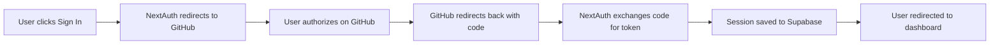

# 🔐 Authentication Setup Guide

This guide will help you configure GitHub OAuth authentication for DevFlow.

## ✅ What's Already Built

Your authentication system is **production-ready** with:

- ✅ **NextAuth.js v5** with GitHub OAuth provider
- ✅ **Supabase adapter** for session storage
- ✅ **Protected routes** via middleware
- ✅ **Sign-in page** with error handling and loading states
- ✅ **Error page** with detailed error messages
- ✅ **Dashboard page** with session management
- ✅ **Session provider** wrapping the entire app

## 🚀 Quick Setup (5 minutes)

### Step 1: Create GitHub OAuth App

1. Go to [GitHub Developer Settings](https://github.com/settings/developers)
2. Click **"New OAuth App"**
3. Fill in the details:
   ```
   Application name: DevFlow
   Homepage URL: http://localhost:3000
   Authorization callback URL: http://localhost:3000/api/auth/callback/github
   ```
4. Click **"Register application"**
5. Copy the **Client ID**
6. Generate a new **Client Secret** and copy it

### Step 2: Set Up Supabase

1. Go to [Supabase](https://supabase.com) and create a new project
2. Wait for the database to be provisioned (~2 minutes)
3. Go to **SQL Editor** and run the SQL from `supabase-schema.sql`
4. Go to **Project Settings > API** and copy:
   - **Project URL** (looks like: `https://xxxxx.supabase.co`)
   - **anon/public key** (starts with `eyJhbGciOiJIUzI1NiIs...`)
   - **service_role key** (starts with `eyJhbGciOiJIUzI1NiIs...`)

### Step 3: Configure Environment Variables

1. Open `.env.local` in your project root
2. Fill in the values:

```env
# Supabase
NEXT_PUBLIC_SUPABASE_URL=https://xxxxx.supabase.co
NEXT_PUBLIC_SUPABASE_ANON_KEY=eyJhbGciOiJIUzI1NiIs...
SUPABASE_SERVICE_ROLE_KEY=eyJhbGciOiJIUzI1NiIs...

# NextAuth
NEXTAUTH_URL=http://localhost:3000
NEXTAUTH_SECRET=your_secret_here

# GitHub OAuth
GITHUB_ID=your_github_client_id
GITHUB_SECRET=your_github_client_secret
```

3. Generate `NEXTAUTH_SECRET`:
```bash
openssl rand -base64 32
```

### Step 4: Test Authentication

1. Start the development server:
```bash
npm run dev
```

2. Visit http://localhost:3000

3. Click **"Get Started"** or **"Sign In"**

4. Click **"Continue with GitHub"**

5. Authorize the app on GitHub

6. You should be redirected to the dashboard! 🎉

## 🔍 How It Works

### Authentication Flow



### Protected Routes

The middleware (`middleware.ts`) automatically protects these routes:
- `/dashboard/*`
- `/analytics/*`
- `/achievements/*`
- `/settings/*`

If a user isn't authenticated, they're redirected to `/auth/signin`.

### Session Management

- **Provider**: `SessionProvider` wraps the entire app in `app/layout.tsx`
- **Hook**: Use `useSession()` in any client component to access user data
- **Storage**: Sessions are stored in Supabase with database strategy
- **Fallback**: If Supabase isn't configured, falls back to JWT strategy

## 📱 Features

### Sign-In Page (`/auth/signin`)

- ✅ Beautiful glassmorphism design
- ✅ Loading states during OAuth flow
- ✅ Error messages if authentication fails
- ✅ Support for `callbackUrl` parameter
- ✅ Mobile responsive
- ✅ Smooth animations

### Dashboard Page (`/dashboard`)

- ✅ Welcome message with user info
- ✅ Profile picture and email display
- ✅ Feature preview cards
- ✅ "Coming Soon" features list
- ✅ Automatic redirect if not authenticated
- ✅ Loading states

### Error Page (`/auth/error`)

- ✅ Detailed error messages for different error types
- ✅ Error code display
- ✅ "Try Again" and "Go Home" buttons
- ✅ Support for all NextAuth error types

## 🛠️ Troubleshooting

### "Failed to sign in"

**Problem**: Environment variables not set correctly

**Solution**:
1. Check `.env.local` has all required variables
2. Restart the dev server after changing env vars
3. Verify GitHub OAuth callback URL matches exactly

### "supabaseUrl is required"

**Problem**: Supabase credentials missing

**Solution**:
- Make sure `NEXT_PUBLIC_SUPABASE_URL` and `NEXT_PUBLIC_SUPABASE_ANON_KEY` are set
- The app will fall back to JWT sessions if Supabase isn't configured

### "Configuration error"

**Problem**: NextAuth configuration issue

**Solution**:
- Verify `NEXTAUTH_URL` matches your domain
- Make sure `NEXTAUTH_SECRET` is set
- Check GitHub OAuth credentials are correct

### OAuth callback not working

**Problem**: Callback URL mismatch

**Solution**:
- Verify GitHub OAuth app callback URL is exactly:
  `http://localhost:3000/api/auth/callback/github`
- For production, update to: `https://your-domain.com/api/auth/callback/github`

## 🚀 Production Deployment

### Vercel Deployment

1. Push your code to GitHub
2. Import to Vercel
3. Add all environment variables in Vercel settings
4. Deploy!

### Update GitHub OAuth for Production

1. Go to your GitHub OAuth app settings
2. Update URLs:
   ```
   Homepage URL: https://your-domain.vercel.app
   Callback URL: https://your-domain.vercel.app/api/auth/callback/github
   ```
3. Update `NEXTAUTH_URL` in Vercel to match your domain

## 📚 API Routes

Authentication is handled by NextAuth at:
```
/api/auth/[...nextauth]
```

Available endpoints:
- `/api/auth/signin` - Initiate sign-in
- `/api/auth/signout` - Sign out user
- `/api/auth/callback/github` - GitHub OAuth callback
- `/api/auth/session` - Get session data

## 🔒 Security Features

- ✅ **HTTPS required** in production
- ✅ **CSRF protection** via NextAuth
- ✅ **Secure cookies** with httpOnly flag
- ✅ **Row Level Security** in Supabase
- ✅ **Token rotation** on refresh
- ✅ **Session expiry** after inactivity

## 📝 Next Steps

After authentication is working:

1. **Test the flow** - Sign in/out multiple times
2. **Try error cases** - Deny authorization, use invalid credentials
3. **Check mobile** - Test on different screen sizes
4. **Build features** - Start building the dashboard features
5. **Deploy** - Push to production when ready

---

## ✨ Success!

If you can sign in with GitHub and see the dashboard, congratulations! 🎉

Your authentication system is fully functional and production-ready.

**Questions or issues?** Check the troubleshooting section above or review the code in:
- `lib/auth.ts` - NextAuth configuration
- `app/(auth)/auth/signin/page.tsx` - Sign-in page
- `middleware.ts` - Route protection
- `components/providers/SessionProvider.tsx` - Session provider
